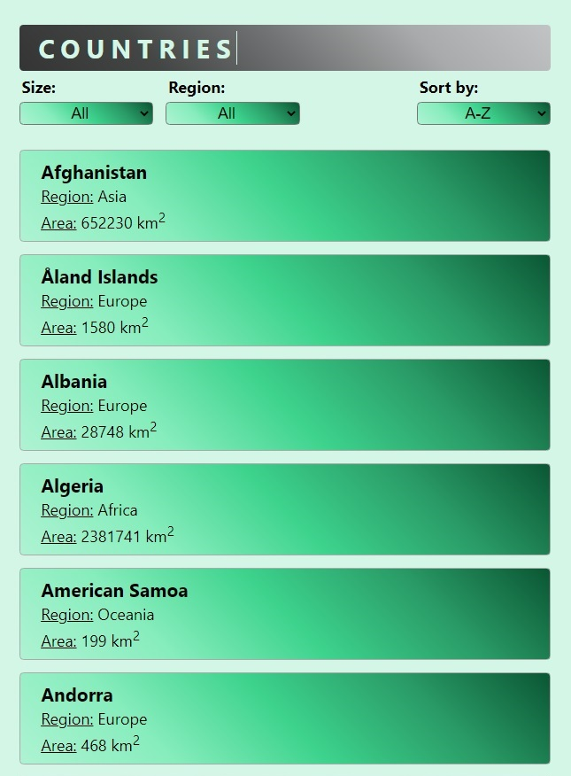

# Countries List

This project was created with React displays the list of world countries data (name, region and area).\
 The list is sortable alphabetically by name (ascending, descending).\
 This list also has filters to filter countries:

- That are smaller than Lithuania by area.
- That are in “Oceania” region.

## Info

It runs on it's own server at `http://localhost:3000`.\
If this port is already runnig another application, you'll be given to choose another port.

#### Run file:

- in current directory open new terminal and write in console:

> `cd countries`\
> `npm i`\
> `npm i axios`\
> `npm start`
